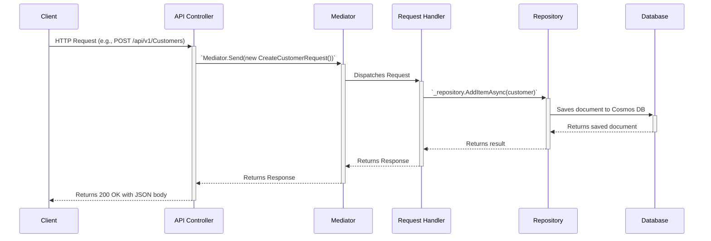

Of course. Here is the content formatted as a proper `README.md` file.

-----

# PropVivo - Real-Time Call Support Portal

This repository contains the backend implementation for the PropVivo Full Stack Coding Assessment. The primary goal of this project is to build a customer support portal that automatically looks up and displays customer information when a call is received, with a plan to integrate real-time voice modulation.

**Current Status:** Backend Core Functionality Complete

## Project Overview

This solution addresses the inefficiency in customer support workflows where agents waste valuable time searching for caller details across multiple systems. The backend is designed to serve a simple portal that:

  * Detects incoming calls in real-time.
  * Automatically identifies the customer based on their phone number.
  * Provides the customer's data to a frontend interface.
  * Is architected to support future integrations like two-way voice communication and real-time accent modulation.

### ✅ Core Features Implemented (Backend)

The following core backend features are complete, tested, and ready for frontend integration:

  * **Automatic Customer Lookup**: An API is available to create new customers and retrieve existing ones by their phone number.
  * **Incoming Call Detection**: A webhook endpoint (`/api/webhooks/incoming-call`) is implemented to simulate receiving a call from a telephony provider (e.g., Twilio).
  * **Real-Time Notification System**: The architecture includes SignalR for real-time communication. When the webhook is called, it triggers a customer lookup and is set up to push this data to connected clients.
  * **Database Integration**: The system is fully connected to a database (Azure Cosmos DB) for storing and retrieving customer and call log information.
  * **Robust Error Handling**: The API includes global exception handling middleware to gracefully manage errors (e.g., customer not found) and return structured error responses.
  * **Security**: API endpoints are secured using JWT Bearer Token authentication.

-----

## 🏗️ Technical Architecture

This project is built following **Clean Architecture** principles, ensuring a clean separation of concerns between the different layers of the application. This makes the system maintainable, scalable, and testable.

  * **`PropVivo.Domain`**: Contains the core business entities (Customer, CallLog) and has no dependencies on other layers.
  * **`PropVivo.Application`**: Implements the business logic using the **CQRS** (Command Query Responsibility Segregation) pattern with the **MediatR** library. Each feature (e.g., "Create Customer") is a self-contained vertical slice with its own Request, Handler, and Validation logic.
  * **`PropVivo.Infrastructure`**: Handles all external concerns, primarily data access. It contains the concrete implementation of the repository pattern for interacting with Azure Cosmos DB.
  * **`PropVivo.API`**: The presentation layer. It exposes the application's features via a versioned RESTful API and handles concerns like routing, authentication, and real-time communication via a SignalR hub.

### Request Flow (CQRS)

The flow for a typical request follows the Clean Architecture and CQRS pattern:



-----

## 🛠️ Technology Stack (Backend)

  * **Framework**: .NET 8 with ASP.NET Core
  * **Architecture**: Clean Architecture, CQRS with MediatR
  * **Database**: Azure Cosmos DB (via the local Emulator)
  * **Real-time**: ASP.NET Core SignalR
  * **Authentication**: JWT Bearer Tokens
  * **API Documentation**: Swagger / OpenAPI

-----

## 🚀 Getting Started & Setup

Follow these instructions to get the backend running locally.

### Prerequisites

1.  **.NET 8 SDK**: [Download here](https://dotnet.microsoft.com/download/dotnet/8.0)
2.  **Azure Cosmos DB Emulator**: [Download here](https://docs.microsoft.com/azure/cosmos-db/local-emulator)
3.  **API Client**: A tool like Postman is highly recommended for testing.
4.  **IDE**: Visual Studio 2022 or VS Code.

### Configuration

1.  **Start the Cosmos DB Emulator**: Run the emulator from your Windows Start Menu. It must be running for the application to connect to the database.
2.  **Clone the Repository**:
    ```bash
    git clone <your-repo-url>
    cd <your-repo-folder>
    ```
3.  **Configure Development Settings**: Open the file `PropVivo.API/appsettings.Development.json` and ensure it contains the following configuration to connect to the local emulator:
    ```json
    {
      "Logging": {
        "LogLevel": {
          "Default": "Information",
          "Microsoft.AspNetCore": "Warning"
        }
      },
      "ConnectionStrings": {
        "CosmosDB": {
          "EndpointUrl": "https://localhost:8081",
          "PrimaryKey": "C2y6yDjf5/R+ob0N8A7Cgv30VRDJIWEHLM+4QDU5DE2nQ9nDuVTqobD4b8mGGyPMbIZnqyMsEcaGQy67XIw/Jw==",
          "DatabaseName": "CallSupportDB",
          "DefaultPartition": "/documentType",
          "Containers": [
            {
              "Name": "CallCenter",
              "Partitions": [
                "/documentType"
              ]
            }
          ]
        }
      },
      "Jwt": {
        "Key": "db3OIsj+BXE9NZDy0t8W3TcNekrF+2d/1sFnWG4HnV8TZY30iTOdtVWJG8abWvB1GlOgJuQZdcF2Luqm/hccMw==",
        "Issuer": "https://localhost:7266"
      }
    }
    ```

### Running the Application

  * **From Visual Studio**:
    1.  Open the `PropVivo.sln` solution file.
    2.  Ensure `httpss` is selected in the debug profile dropdown.
    3.  Press `F5` to build and run the project.
  * **From the Command Line**:
    1.  Navigate to the root directory of the repository.
    2.  Run the following command to launch using the correct profile:
    <!-- end list -->
    ```bash
    dotnet run --project PropVivo.API --launch-profile https
    ```

The application will start, and the console will show it is listening on `https://localhost:7266`. The Swagger UI should open automatically in your browser.

-----

## 🧪 API Testing Guide

The following steps outline how to test the completed backend features using Postman.

### Step 1: Generate an Authentication Token

All secure endpoints require a Bearer Token. First, generate a temporary token.

  * **Method**: `GET`
  * **URL**: `https://localhost:7266/api/authentication/generate-token`
  * **Authorization**: No Auth
  * **Result**: You will get a JSON response with a token. Copy the token string for the next steps.

### Step 2: Create a Customer

  * **Method**: `POST`
  * **URL**: `https://localhost:7266/api/v1/Customers`
  * **Authorization**: Type Bearer Token, paste the token from Step 1.
  * **Body**: Type `raw`, format `JSON`.
    ```json
    {
      "name": "John Doe",
      "phoneNumber": "+15551234567",
      "email": "john.doe@example.com",
      "address": "123 Main St, Anytown, USA",
      "notes": "First time caller."
    }
    ```
  * **Expected Response**: `200 OK` with a success message and the new customer's ID. You can verify the entry in the Cosmos DB Emulator's Data Explorer.

### Step 3: Get a Customer by Phone

  * **Method**: `GET`
  * **URL**: `https://localhost:7266/api/v1/Customers/by-phone/+15551234567`
  * **Authorization**: Type Bearer Token, paste the token.
  * **Expected Response**: `200 OK` with the full details of the customer created in Step 2.

### Step 4: Simulate an Incoming Call (Webhook Test)

This test simulates Twilio calling your webhook when a call is received.

  * **Method**: `POST`
  * **URL**: `https://localhost:7266/api/webhooks/incoming-call`
  * **Authorization**: No Auth
  * **Body**: Type `x-www-form-urlencoded`.
      * **KEY**: `From`
      * **VALUE**: `+15551234567` (the phone number of the customer you created).
  * **Expected Response**: `200 OK` with an XML body `<Response>....`. In the application console, you will see a log message showing that the `GetCustomerByPhoneRequest` was handled, proving the lookup was triggered.